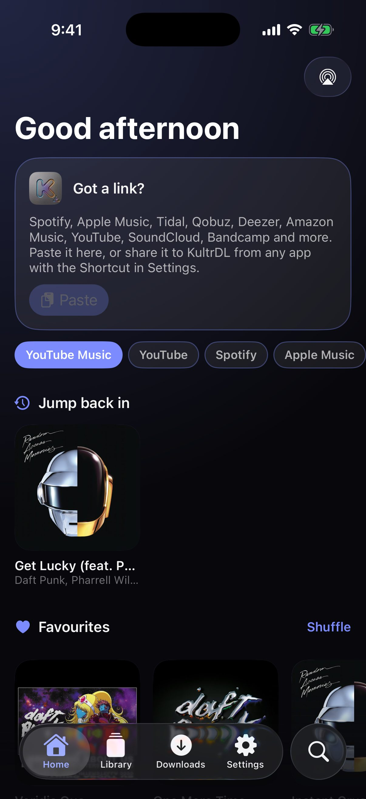
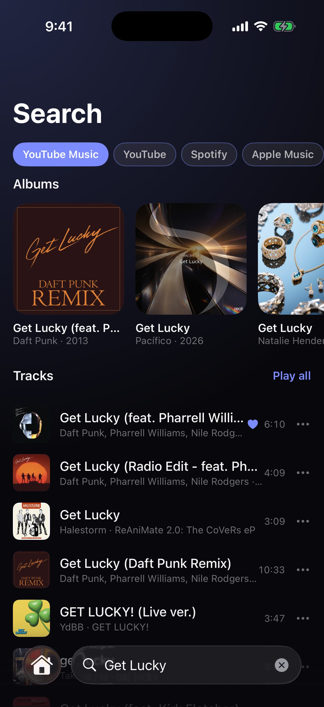
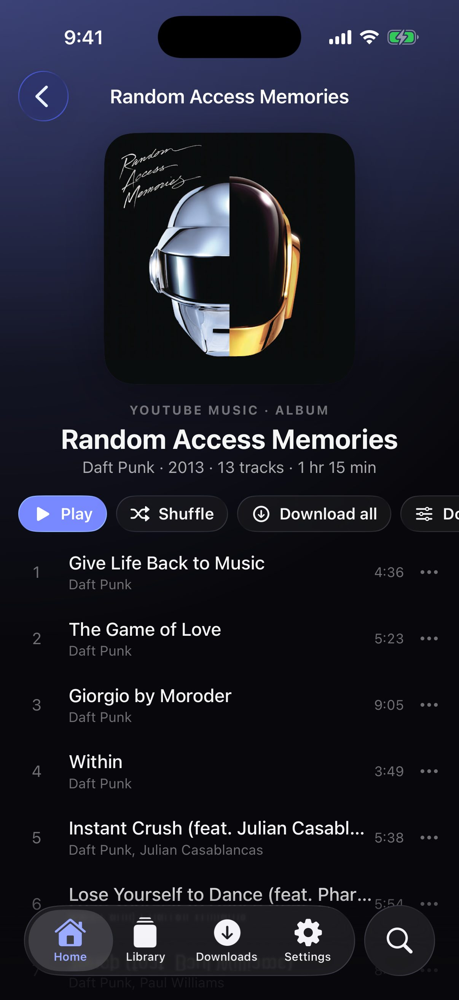
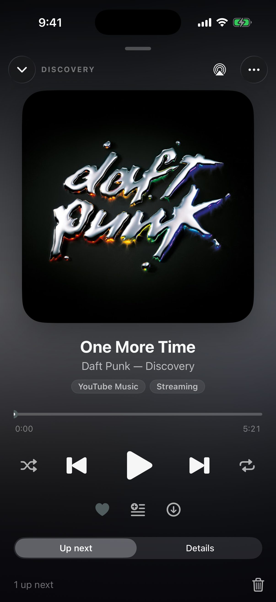
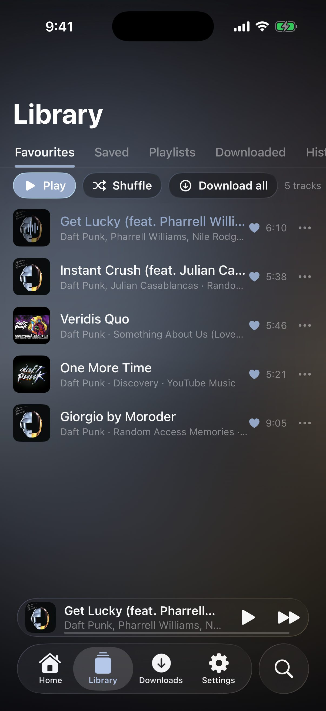

# KultrDL for iOS

Search, play, save and download music on the iPhone, in the design of
[Kultr for iOS](https://github.com/evropiani/Kultr_iOS). It is the iOS
counterpart of [KultrDL for Android](https://github.com/evropiani/KultrDL):
the same sources, formats and servers, and backups that move between the two.

<p align="center">
  
  
  
  
  
</p>

## Features

- **Every source.** Search YouTube Music, YouTube, SoundCloud, Bandcamp,
  Apple Music, Deezer and (with your own free API key) Spotify. Paste a link
  from any of them, or from Tidal, Qobuz or Amazon Music. Catalogue tracks
  (Spotify, Apple Music…) play and download from the matching recording on
  YouTube Music, keeping the catalogue's title, album, track numbers and
  cover.
- **Downloads in the format you want:** FLAC, MP3 (320, V0…), AAC, Opus,
  ALAC, WAV or Ogg Vorbis, with the tags and cover art inside. “Original”
  keeps YouTube's AAC or Opus stream without re-encoding. Downloads show in
  the Files app (On My iPhone › KultrDL › Music), so any player can open them.
- **Straight to your server.** Send downloads to a NAS, seedbox or computer
  over SFTP, FTPS (explicit or implicit) or FTP, into a folder you picked with
  the built-in browser, flat or as Artist / Album folders. SSH keys in
  OpenSSH, PEM or PuTTY format; the server's key or certificate is pinned the
  first time and checked every time after.
- **A player.** A queue you can reorder, shuffle and repeat, the lock screen,
  Control Center, AirPods and AirPlay; the full-screen player pulls down like
  a card, and the mini player rides on the tab bar.
- **Your library on the phone:** favourites, saved tracks, your own playlists
  (or any album or playlist saved as one), downloads and listening history.
- **Kultr's look.** Liquid glass on iOS 26 — the system tab bar with its lens,
  the round search button growing into the field, the mini player as its
  accessory — and a floating glass bar that behaves the same on iOS 17 and 18.
  The whole interface takes its colour from the artwork of what is playing.
- **Suggestions, made on the phone.** “For you” on Home shows new releases
  from the artists you play, mixes made for you (Daily Mixes, Release Radar,
  Discover, “Because you play…”), albums to try, albums missing from your
  collection, and old favourites to rediscover. It learns from what you play,
  skip, heart, save, download and put in playlists — and, if you like, from
  the Music app's library (with play counts and ratings), your Navidrome
  (plays, stars, ratings and what you own), Last.fm and ListenBrainz. New
  music is found through Deezer's and Apple Music's catalogues and YouTube
  Music's radio. Touch and hold a suggestion for “More like this”, “Not
  interested” or “Never this artist”; a slider sets how familiar or new the
  mixes are; genres can be left out. New releases can notify you as they
  come out or in a weekly summary. Mixes can be saved as playlists that
  update themselves every day.
- **Navidrome.** Connect your server and its songs play in mixes straight
  from it; “Download to Navidrome” puts downloads into its music folder (over
  your saved SFTP/FTP server) and asks it to rescan.
- **Block artists.** Their songs, and every song they're featured on, are
  hidden everywhere (search, albums, playlists, library, suggestions) and
  skipped if they come up in the queue.
- **Backup and restore** of the library, settings, servers and Navidrome
  (without passwords), blocked artists and your answers to suggestions as one
  JSON file, in the same format as KultrDL for Android.

## No yt-dlp, no ffmpeg

iOS can't run Python or ffmpeg the way Android does, so KultrDL does their
work natively:

- **Streams** come from YouTube's own player API (the clients yt-dlp uses:
  visionOS, TV, embedded, Android VR, iOS), with the signature and “n”
  challenges solved in JavaScriptCore by the same solver scripts as yt-dlp
  (yt-dlp/ejs). When YouTube refuses one client's stream, the next is tried
  and the one that works is remembered. SoundCloud and Bandcamp are read from
  their own pages.
- **YouTube changes often,** so the client versions and solver scripts
  update themselves from [`engine/youtube.json`](engine/youtube.json) in this
  repository, once a day (Settings → Engine), without a new release. Settings
  → Engine → **Test YouTube** tries every client and writes a report.
- **Conversion** uses LAME, libFLAC, libopus/libopusenc and libvorbis, plus
  AVFoundation for AAC and ALAC, with a WebM demuxer, Ogg Opus remuxing, and
  ID3v2.3, Vorbis comment, FLAC picture and MP4 tag writers.
- **FTP/FTPS** is written on Apple's networking, **SFTP** on SwiftNIO SSH.

## Getting it

KultrDL isn't on the App Store. You install it yourself (*sideloading*),
which works on any iPhone or iPad with iOS 17 or later, without
jailbreaking, with a free Apple ID.

**➡️ Step-by-step guide for first-timers: [docs/INSTALL.md](docs/INSTALL.md)**

In short: download `KultrDL.ipa` from the
[latest release](https://github.com/evropiani/KultrDL_iOS/releases/latest)
and install it with [Sideloadly](https://sideloadly.io) (Windows, macOS),
[AltStore](https://altstore.io) (Windows, macOS),
[Impactor](https://github.com/khcrysalis/PlumeImpactor) (Linux), or on the
iPhone alone with SideStore.

**AltStore / SideStore source:** `https://gist.githubusercontent.com/evropiani/6e3a3c18525a228d03924674430c4d48/raw/evropiani.json`
Add it under **Sources**, next to Kultr, and new versions arrive as updates.

**Opening links from other apps:** iOS apps installed this way can't add
themselves to the share sheet, but a one-step Shortcut can: see Settings →
Open links from other apps. `kultrdl://open?url=<link>` opens any link in
KultrDL.

Only download music you have the right to keep.

## Building

Requirements: macOS with Xcode 26 or newer (the app runs on iOS 17 and later).

```sh
swift test --package-path KultrDLKit        # core, recommendation, media and tag tests, no simulator needed
swift run --package-path KultrDLKit kultrdl-probe   # checks against the real sites
open KultrDL.xcodeproj                      # choose your team under Signing & Capabilities, then Run
```

The unsigned IPA the workflow publishes:

```sh
xcodebuild build -project KultrDL.xcodeproj -scheme KultrDL -configuration Release \
  -sdk iphoneos -destination 'generic/platform=iOS' -derivedDataPath build \
  CODE_SIGNING_ALLOWED=NO
mkdir -p Payload && cp -R build/Build/Products/Release-iphoneos/KultrDL.app Payload/
zip -qry KultrDL.ipa Payload
```

### Releasing

Bump `MARKETING_VERSION` in `KultrDL.xcodeproj/project.pbxproj`, add notes as
`.github/release-notes/v<version>.md`, and push to `main`. The **iOS**
workflow runs the package tests, builds the IPA and publishes it as the
GitHub release `v<version>` (replacing its IPA when the release exists). It
then adds the release to the AltStore / SideStore source in the gist
([evropiani.json](https://gist.github.com/evropiani/6e3a3c18525a228d03924674430c4d48),
by `.github/scripts/update-source.py`, with the store page from
`.github/source/kultrdl.json`), using the `GIST_TOKEN` secret.

To fix YouTube for everyone without a release, edit
[`engine/youtube.json`](engine/youtube.json) (bump its `version`) and push to
`main`; a unit test checks the file still decodes.

On other branches the workflow builds for the simulator, takes screenshots
(including a real download and conversion), and runs `kultrdl-probe`:
searches, links, every YouTube client, downloads, every conversion, the
recommendation sources and a whole “For you” page, a throwaway Navidrome, and
uploads to throwaway FTP, FTPS and SFTP servers with every kind of SSH key.

## How it is put together

| Part | What it holds |
| --- | --- |
| `KultrDLKit/Sources/KultrDLCore` | The recommendation engine (taste profile, ranking, mixes, artist blocking), the Navidrome (Subsonic), Last.fm and ListenBrainz clients, the catalogues, link recognition, the matcher, YouTube's player API with the JavaScript challenge solver, SoundCloud and Bandcamp streams, HLS, the stream downloader, and the formats written by hand (WebM, ID3, Vorbis comments, WAV). |
| `KultrDLKit/Sources/KultrDLMedia` | Decoding and encoding: FLAC, MP3, AAC, ALAC, WAV, Opus and Vorbis, with tags and cover art. |
| `KultrDLKit/Sources/KultrDLRemote` | FTP, FTPS and SFTP sessions, and the private key parser (with OpenBSD's bcrypt_pbkdf for passphrase-protected OpenSSH keys). |
| `KultrDL` | The SwiftUI app: the library, the listening log, the download queue, the player, the recommender (daily in the background), and the Kultr interface. |

Dependencies: [lame](https://github.com/sbooth/lame-binary-xcframework),
[FLAC](https://github.com/sbooth/flac-binary-xcframework),
[ogg](https://github.com/sbooth/ogg-binary-xcframework),
[vorbis](https://github.com/sbooth/vorbis-binary-xcframework) and
[opus](https://github.com/sbooth/opus-binary-xcframework) as prebuilt
XCFrameworks, [Citadel](https://github.com/orlandos-nl/Citadel) and SwiftNIO
SSH for SFTP, and the [yt-dlp/ejs](https://github.com/yt-dlp/ejs) solver
scripts (bundled).

## License

GNU General Public License v3.0, like KultrDL for Android. See [LICENSE](LICENSE).
